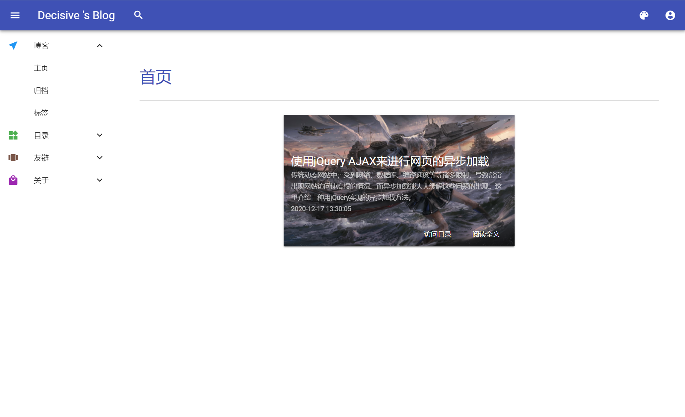
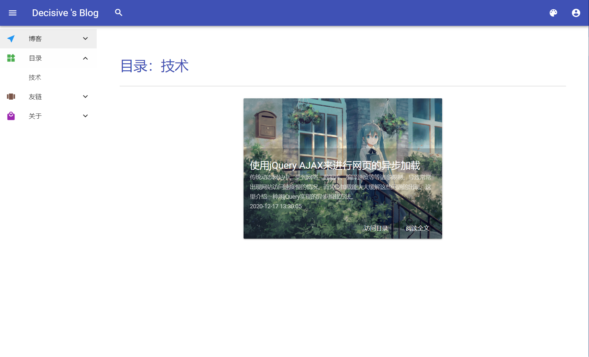
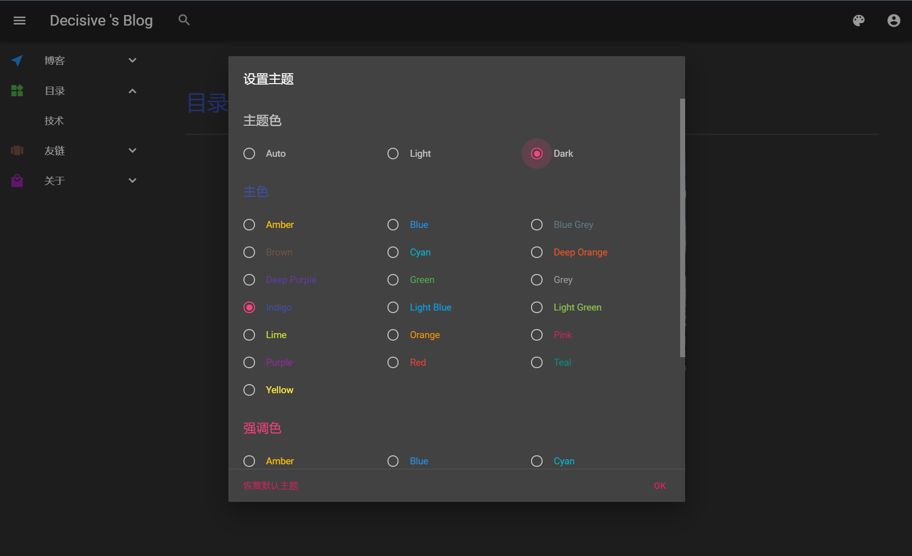
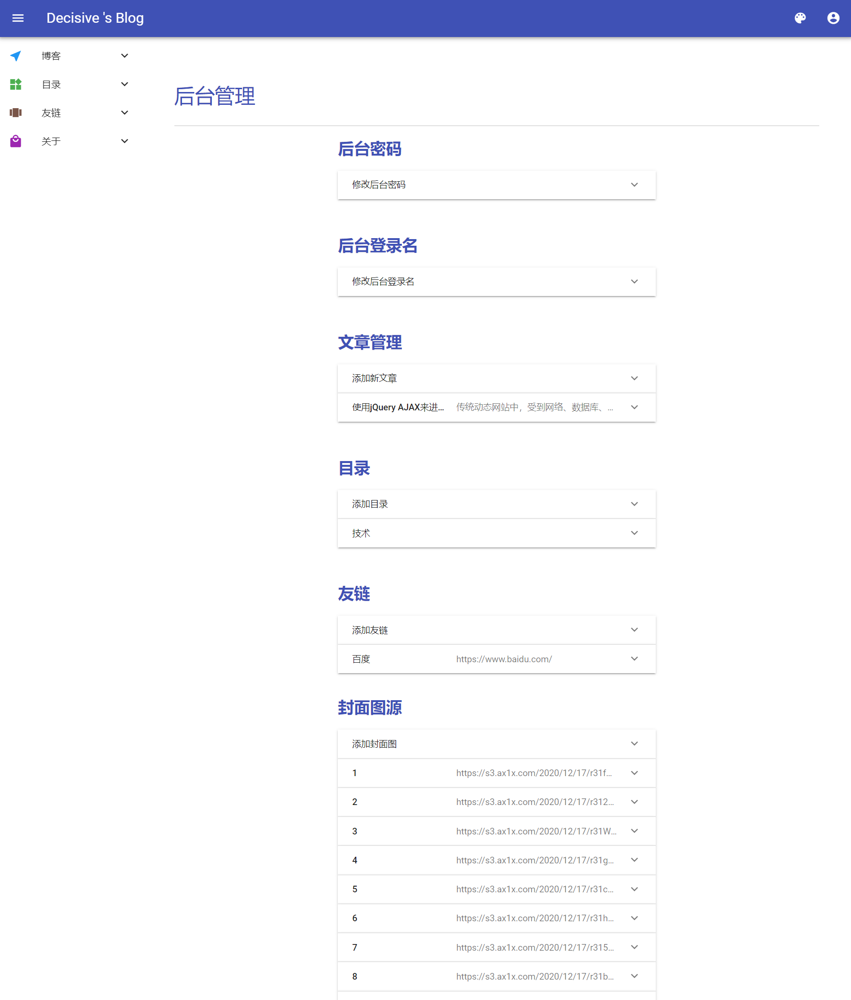
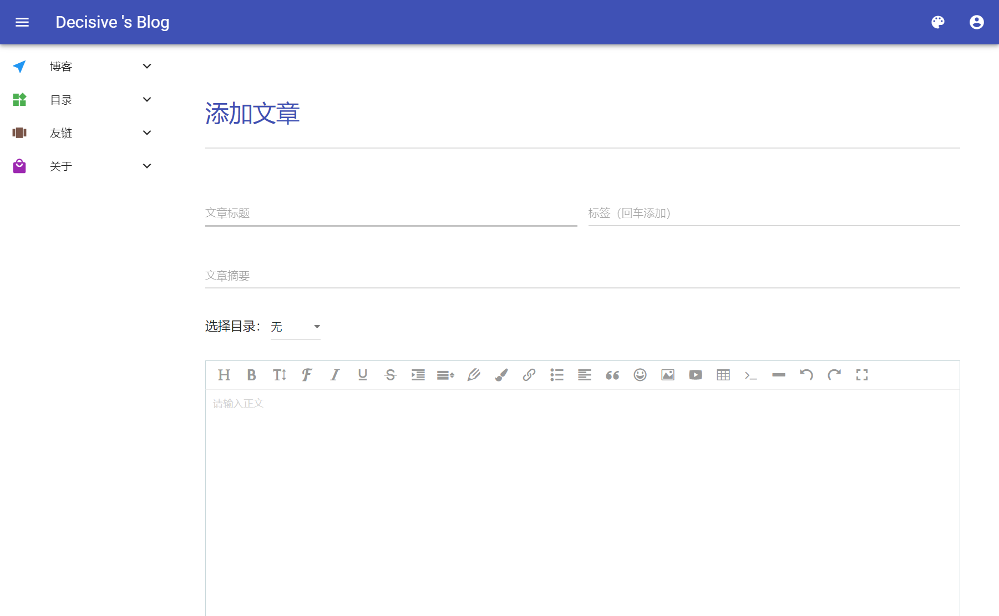
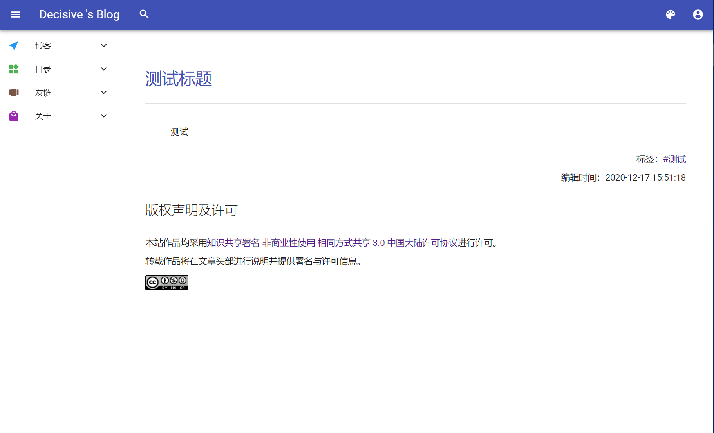

# MDUI-Blog
这是一个基于MDUI框架和PHP的融合Vue，JQuery等框架和类库的前后端异步分离的开源博客（帮别人写期末作业练手用的）

## 目录
- [开发（推荐运行）环境](#开发（推荐运行）环境)
- [部署方式](#部署方式)

## 开发（推荐运行）环境
- 数据库 MySQL 8.0
- 应用服务器 Apache/Nginx
- Web服务器 PHP 7.4
- Git

## 部署方式 
一、部署网站目录  
注：假定网站运行目录为/www/wwwroot/xxx.xxx.xxx，部署时改为自己的目录
1. 进入网站目录
```shell
cd /www/wwwroot/xxx.xxx.xxx
```   

2. 利用Git Clone克隆到本地
```shell 
git clone https://github.com/UtopiaXC/MDUI-Blog.git
```
   
3. 将全部文件移至网站目录
```shell
mv /www/wwwroot/xxx.xxx.xxx/MDUI-Blog/* /www/wwwroot/xxx.xxx.xxx
```
   
4. 在Apache/Nginx设置中将网站默认文档改为index.html

5. 授予文件读写权限
```shell
chmod -R 777 /www/wwwroot/xxx.xxx.xxx
```  
   

二、部署数据库
1. 打开mysql
```shell
mysql -u username -p
```
   
2. 新建数据库
```mysql
CREATE DATABASE Blog
```
   
3. 选择新建的数据库
```mysql
USE Blog
```
   
4. 执行SQL脚本（位于项目文件夹中的sql文件夹）（假定已经移动到网站目录）
```mysql
SOURCE /www/wwwroot/xxx.xxx.xxx/sql/blog.sql
```
   
5. 修改数据库配置文件，其中将username改为自己的数据库用户名，password为自己的数据库密码，db为刚才建立的新的数据库名
```shell
vim /www/wwwroot/xxx.xxx.xxx/config.php
```
   
三、关于界面  
关于界面我没写，想写的自己写一下

四、初始账户和密码  
登录名：admin
密码：admin

## Demo  
朋友已经部署好的网站：[https://decisive.icu/](https://decisive.icu/)  

部分截图（如果无法加载请使用代理）  

#### 主页 


#### 目录


#### 主题


#### 后台管理


#### 文章编辑


#### 文章页


## 相关问题
由于本项目仍在开发，目前以下功能未完成（心情好就写，反正也没人用）
1. 归档
2. 标签云
3. 关于界面
4. 文章的内容的叠层样式表
5. footer版权页脚
6. 评论系统
7. 审核系统